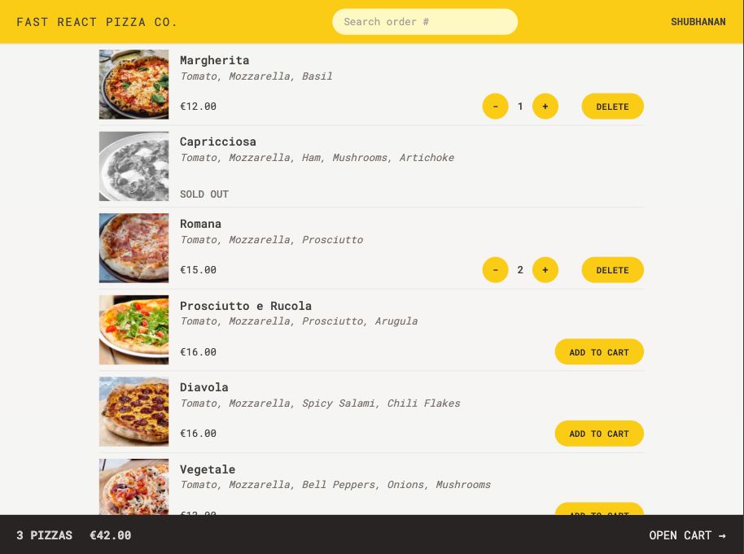

# Fast React Pizza Co.

A modern React application for ordering pizzas online, built with React, Redux, React Router, and Tailwind CSS.



## Overview

Fast React Pizza Co. is a fully functional pizza ordering application that allows users to browse the menu, add items to cart, place orders, and track their order status. The application features a clean and responsive user interface built with Tailwind CSS.

## Features

- **User Management**: Create and persist user information
- **Menu Browsing**: View all available pizza options
- **Shopping Cart**: Add, remove, and update quantities of items in the cart
- **Order Creation**: Place orders with delivery information
- **Order Tracking**: Look up and track the status of placed orders
- **Geolocation**: Automatically detect user's address using geolocation services
- **Responsive Design**: Fully responsive interface that works on mobile and desktop

## Project Structure

The project follows a feature-based architecture:

```
src/
├── features/
│   ├── cart/          # Cart management components and logic
│   ├── menu/          # Menu display components
│   ├── order/         # Order creation and tracking
│   └── user/          # User management
├── ui/                # Reusable UI components
├── services/          # API services
├── utils/             # Utility functions
└── App.jsx            # Main application component
```

### Key Components

- **AppLayout**: Main layout wrapper with header and footer
- **Menu**: Displays available pizzas from the API
- **Cart**: Shows selected items and order summary
- **CreateOrder**: Form for submitting delivery information
- **Order**: Displays order details and status

## Getting Started

### Prerequisites

- Node.js (v16.0.0 or higher)
- npm (v7.0.0 or higher)

### Installation

1. Clone the repository:

   ```
   git clone https://github.com/shubhs27/Fast-react-pizza.git
   cd fast-react-pizza
   ```

2. Install dependencies:

   ```
   npm install
   ```

3. Start the development server:

   ```
   npm run dev
   ```

4. Open your browser and navigate to `http://localhost:5173` (or the port shown in your terminal)

### Building for Production

```
npm run build
```

## Technologies Used

- **React**: UI library
- **Redux Toolkit**: State management
- **React Router**: Navigation and routing
- **Tailwind CSS**: Utility-first styling
- **Vite**: Build tool and development server

## API Integration

The application communicates with the Fast React Pizza API:

- API base URL: `https://react-fast-pizza-api.jonas.io/api`
- Endpoints:
  - `/menu`: Get all available menu items
  - `/order`: Create a new order
  - `/order/:id`: Get or update a specific order

The application also integrates with the BigDataCloud API for reverse geocoding to convert coordinates to addresses.

## Redux Store Structure

The Redux store is organized with the following slices:

- **userSlice**: Manages user information
- **cartSlice**: Handles the shopping cart state

## Environment Variables

The following environment variables can be set in a `.env` file:

```
VITE_API_URL=https://react-fast-pizza-api.jonas.io/api
```

## 🙏 Acknowledgments

- This project is part of Jonas Schmedtmann's Udemy course - The Ultimate React Course 2025
- All assets and UI components are inspired by the course material.
